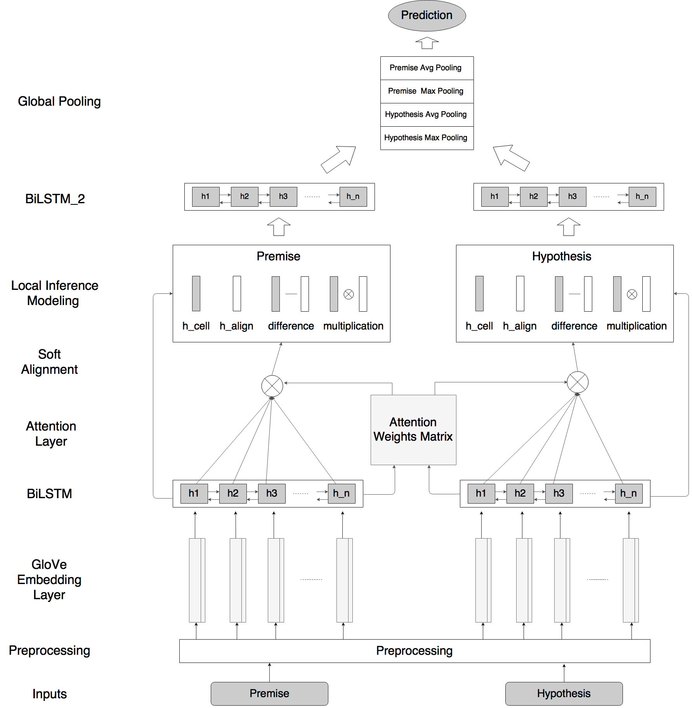

# Kaggle Competition: Quora Question Pairs Problem

Only implement on a single model - ESIM

See infomation on [https://www.kaggle.com/c/quora-question-pairs](https://www.kaggle.com/c/quora-question-pairs)

Framework
---------




References
----------

1. [A decomposable attention model for natural language inference (2016)](https://arxiv.org/abs/1606.01933) proposed by Aparikh, Oscart, Dipanjand, Uszkoreit.

2. [Reasoning about entailment with neural attention (2016)](https://arxiv.org/abs/1509.06664) proposed by Tim Rockta schel.

3. [Neural Machine Translation by Jointly Learning to Align and Translate (2016)](https://arxiv.org/abs/1409.0473) proposed by Yoshua Bengio, Dzmitry Bahdanau, KyungHyun Cho.

4. [Enhanced LSTM for Natural Language Inference (2017)](https://arxiv.org/abs/1609.06038) proposed by Qian Chen, Xiaodan Zhu, Zhenhua Ling, Si Wei, Hui Jiang, Diana Inkpen.


Prerequisites
-------------

- python 2.7 or 3+
- numpy
- [Tensorflow](https://www.tensorflow.org/)
- [Keras](https://github.com/fchollet/keras)
- [spaCy](https://spacy.io)

Download spaCy pre-trained Glove embedding weights

    # out-of-the-box: download best-matching default model
    $ python -m spacy download en

    # download best-matching version of specific model for your spaCy installation
    $ python -m spacy download en_core_web_md


Usage
-----

To clean the inputs data, and split them into training and validation data run:

    $ bash clean.sh

To train a model on default settings: (epochs: 10, embedding size: 300, hidden units: 100, learning rate: 0.0004)

    $ python run.py --mode=train --verbose --best_glove

To test a model:

    $ python run.py --mode=eval


All options:
```
usage: run.py [-h] [--num_epochs NUM_EPOCHS] [--batch_size BATCH_SIZE]
              [--embedding_size EMBEDDING_SIZE] [--max_length MAX_LENGTH]
              [--seed SEED] [--input_data INPUT_DATA] [--test_data TEST_DATA]
              [--val_data VAL_DATA] [--num_classes NUM_CLASSES]
              [--num_hidden NUM_HIDDEN] [--num_unknown NUM_UNKNOWN]
              [--learning_rate LEARNING_RATE] [--keep_prob KEEP_PROB]
              [--best_glove] [--tree_truncate] [--verbose]
              [--load_model LOAD_MODEL] --mode MODE

optional arguments:
  -h, --help            show this help message and exit
  --num_epochs NUM_EPOCHS
                        Specify number of epochs
  --batch_size BATCH_SIZE
                        Specify number of batch size
  --embedding_size EMBEDDING_SIZE
                        Specify embedding size
  --max_length MAX_LENGTH
                        Specify the max length of input sentence
  --seed SEED           Specify seed for randomization
  --input_data INPUT_DATA
                        Specify the location of input data
  --test_data TEST_DATA
                        Specify the location of test data
  --val_data VAL_DATA   Specify the location of test data
  --num_classes NUM_CLASSES
                        Specify the number of classes
  --num_hidden NUM_HIDDEN
                        Specify the number of hidden units in each rnn cell
  --num_unknown NUM_UNKNOWN
                        Specify the number of unknown words for putting in the
                        embedding matrix
  --learning_rate LEARNING_RATE
                        Specify dropout rate
  --keep_prob KEEP_PROB
                        Specify the rate (between 0 and 1) of the units that
                        will keep during training
  --best_glove          Glove: using light version or best-matching version
  --tree_truncate       Specify whether do tree_truncate or not
  --verbose             Verbose on training
  --load_model LOAD_MODEL
                        Locate the path of the model
  --mode MODE           Specify mode: train or eval or predict
```
